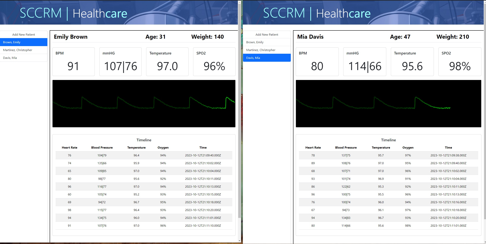

# Team-SCCRM: Remote Patient Monitoring

## Deployed Link
https://sccrm-diagnostics-7fb52a7a34b8.herokuapp.com/

## Description

Welcome to Team SCCRM's Remote Patient Monitoring system, a web application for remotely managing and monitoring hospital patient vital signs. This system uses a MySQL database, Express server, and Socket.io for real-time communication on the frontend. The app provides secure and efficient means to store and view patients' health information, making it a valuable tool for healthcare professionals and institutions.

## Table of Contents

- [Installation](#installation)
- [Features](#features)
- [Credits](#credits)
- [License](#license)

## Installation

Prerequisites
Before you begin, ensure you have met the following requirements:  

- Node.js: You should have Node.js installed. If not, you can download it from nodejs.org.
- MySQL: Install MySQL database server and configure it. You may use tools like MySQL Workbench for managing the database.
- Git: It's recommended to have Git installed to clone the repository and contribute to the project.
- npm: Node Package Manager is included with Node.js. You can use it to install project dependencies.

## Features

- User Authentication: Secure user authentication and authorization system to control access to patient records.
- Patient Record Management: Create and view patient records, including personal information and vitals history.
- Real-Time Communication: Utilize WebSocket for up-to-date vitals readout of any patient. Vonage SMS services send alerts directly to a doctor's phone if patient is critical.
- Data Visualization: A pulse oximetry reading for each patient is displayed in real-time.

## Credits

- <a href="https://github.com/Elrond-Hubbard">Michael Marsolo</a>
- <a href="https://github.com/ChrisDeHaan">Christopher DeHaan</a>
- <a href="https://github.com/RachelCodes42">Rachel Hochman</a>
- <a href="https://github.com/Bunde20">Steven Bunde</a>
- <a href="https://github.com/CambiG1123">Campbell Gilliland</a>

## Technologies Used
- MySql
- Express.js
- Node.js
- Socket.IO
- bCrypt
- Tone.js
- Vonage SMS
- Bootstrap 5.3.2

## License